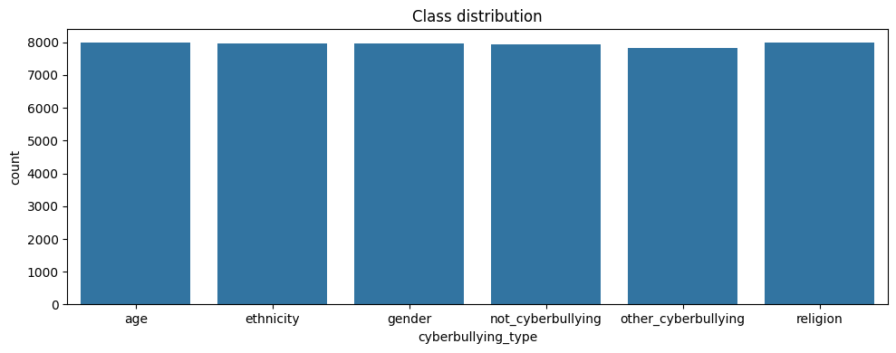

# Cyberbullying Classification in Tweets

A compact Data Science / NLP portfolio project that analyzes short social-media texts and compares **lexical** and **semantic** text representations for multiclass cyberbullying classification.

## Project Overview

This project studies how tweet representations affect classification performance when the goal is to assign each tweet to a cyberbullying category. The analysis is intentionally simple and transparent: the downstream classifier is held constant while the text representation changes.

## Research Question

> **How do lexical and semantic text representations affect multiclass cyberbullying classification in short social-media texts?**

## Dataset Description

The dataset used in this project contains two variables:

- `tweet`: the tweet text
- `type`: the target class

Original target space (six classes):

- `age`
- `ethnicity`
- `gender`
- `not_cyberbullying`
- `other_cyberbullying`
- `religion`



## Methodology

Two comparable pipelines are used in the first experimental stage.

### Pipeline A — TF-IDF baseline

Dataset  
↓  
Data cleaning  
↓  
Stratified train/test split  
↓  
TF-IDF representation  
↓  
Logistic Regression

### Pipeline B — Sentence Transformer representation

Dataset  
↓  
Data cleaning  
↓  
**Same train/test split**  
↓  
Sentence Transformer embeddings  
↓  
Logistic Regression

Using the same split and the same downstream classifier makes the text representation the main experimental difference.

### Evaluation Metrics

The experiments are evaluated with:

- Accuracy
- Macro F1
- Weighted F1
- Precision
- Recall
- Per-class F1
- Confusion matrix

## Experimental Design

### Stage 1 — Six-class classification

The first stage keeps the original six-class target space and compares:

1. **TF-IDF + Logistic Regression**
2. **Sentence Transformer embeddings + Logistic Regression**

### Stage 2 — Five-class classification

The second stage excludes `other_cyberbullying` and focuses on the five more specifically defined categories:

- `age`
- `ethnicity`
- `gender`
- `not_cyberbullying`
- `religion`

This is a **methodological decision**, not a performance optimization. The `other_cyberbullying` label functions as a heterogeneous residual category rather than a clearly defined abuse type. Because it can contain multiple linguistic patterns and may overlap conceptually with `not_cyberbullying`, it produces a less interpretable class boundary. The five-class experiment therefore focuses on the more specific categories.

> **Important:** the five-class results should **not** be presented as a direct improvement over the six-class results, because the target space changes from six classes to five.

## Results

### Stage 1 — Six-class comparison

| Representation | Classifier | Accuracy | Macro F1 |
| --- | --- | ---: | ---: |
| TF-IDF | Logistic Regression | 0.8177 | 0.8188 |
| Sentence Transformer embeddings | Logistic Regression | 0.8106 | 0.8085 |


### Stage 2 — Five-class TF-IDF experiment

| Experiment | Accuracy | Macro F1 |
| --- | ---: | ---: |
| Five-class TF-IDF + Logistic Regression | 0.9277 | 0.9283 |

In other words, the five-class experiment achieved **92.77% accuracy** and **92.83% macro F1** on the test set.

### Five-class per-class F1

| Class | F1 |
| --- | ---: |
| age | 0.97 |
| ethnicity | 0.98 |
| gender | 0.89 |
| not_cyberbullying | 0.84 |
| religion | 0.95 |

## Confusion Matrix / Error Analysis

The five-class confusion matrix indicates that the main remaining confusion occurs between:

- `gender` → `not_cyberbullying`: **208** cases
- `not_cyberbullying` → `gender`: **86** cases

This suggests that the most difficult boundary is not between all abusive and non-abusive content in general, but specifically between some gender-related tweets and tweets labeled as non-cyberbullying.


### Misclassification focus

The most useful qualitative error analysis is to inspect misclassified examples from:

- `gender` predicted as `not_cyberbullying`
- `not_cyberbullying` predicted as `gender`

These cases can help identify whether ambiguity comes from sarcasm, implicit abuse, annotation subjectivity, weak lexical cues, or context that is missing from isolated short texts.

## Discussion

The results show that a simple linear baseline using TF-IDF performs competitively in the six-class setting and slightly outperforms the Sentence Transformer representation in this experimental setup. TF-IDF achieved a macro-F1 of 0.819 with a runtime of approximately 6 seconds, compared with a macro-F1 of 0.808 and approximately 3.47 minutes for the Sentence Transformer approach.

This result highlights an important consideration in short-text classification: sparse lexical representations can remain highly effective when the target classes are strongly associated with specific linguistic patterns. More complex and computationally expensive representations do not necessarily translate into better predictive performance for every task.

The five-class experiment should be interpreted as a cleaner analytical formulation rather than as a direct performance improvement over the six-class problem. The `other_cyberbullying` category was excluded because it represents a more heterogeneous group than the other cyberbullying categories, creating a less clearly defined boundary with `not_cyberbullying`. By focusing on the more specifically defined categories, the second experiment provides a more interpretable view of the classification task.

Under this formulation, the same TF-IDF-based approach achieved a macro-F1 of 0.928. However, this result should be compared only within the five-class setting, since the underlying classification problem differs from the original six-class formulation.
> **Note:** Runtime measurements are specific to the experimental environment and should be interpreted as relative computational costs rather than universal benchmarks.
## Limitations

- The dataset contains only tweet text and class labels.
- Tweets are short, noisy, and often context-dependent.
- The analysis does not incorporate conversation context, user metadata, or temporal information.
- The `other_cyberbullying` class is heterogeneous, which complicates interpretation in the original six-class setting.
- Results are specific to this dataset and split.

## Possible Next Steps

- Perform deeper qualitative analysis of `gender` vs `not_cyberbullying` errors.
- Compare alternative linear models or class-weighting strategies while keeping the task definition fixed.
- Evaluate additional sentence embedding models using the same split and classifier.
- Analyze annotation ambiguity and potential class overlap.

## Reproducibility

1. Create and activate a Python environment.
2. Install the dependencies:

   ```bash
   pip install -r requirements.txt
   ```

3. Place the dataset CSV inside `data/` with the required columns:

   - `tweet`
   - `type`

4. Open and run `cyberbullying_analysis.ipynb`.
5. Add or replace the figures in `images/`.

## Repository Structure

```text
cyberbullying-nlp/
│
├── README.md
├── cyberbullying_analysis.ipynb
├── requirements.txt
│
├── data/
│   └── README.md
│
└── images/
    ├── class_distribution.png
    ├── model_comparison.png
    └── confusion_matrix.png
```
## About the Data
Dataset file from: J. Wang, K. Fu, C.T. Lu, “SOSNet: A Graph Convolutional Network Approach to Fine-Grained Cyberbullying Detection,” Proceedings of the 2020 IEEE International Conference on Big Data (IEEE BigData 2020), December 10-13, 2020.
